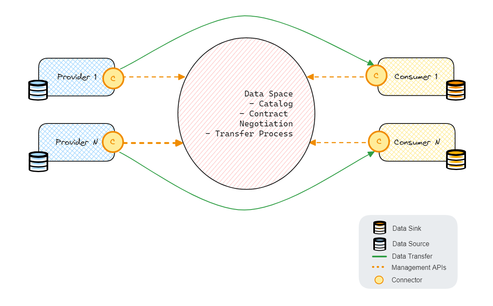

# Data Spaces in Huawei Cloud

## Why data spaces
The unprecedented growth of digital economy in the past decade has to lead to many new data technologies such as 
big data, data lakes, data mining, data analysis and many more. These aimed at ingesting vast amounts of complex data 
and generate tangible information out of it. Data is also the foundational building block of AI and ML.

All such data processing and consumption techniques were applied mostly on datasets which were centrally hosted 
and consumed mostly by the sole owners of the data. But with data becoming the new currency and asset, 
the organizations who own data can increase its value only by sharing them across organizations, sectors, domains, borders, etc. 

This has lead to the emergence of **data spaces** ecosystem which aims at building frameworks for 
sharing decentralized data with the highest level of security, trust and control. 

## Components of a data space

